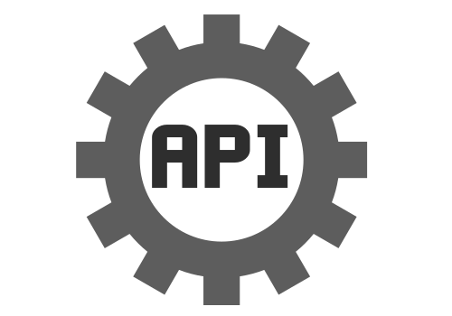
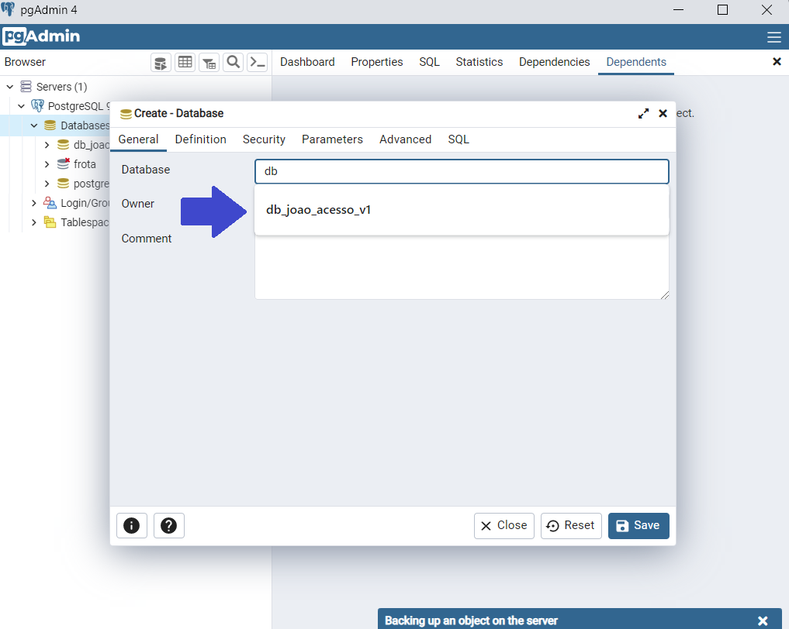

<h1>API João Acesso 🧬<h1>

### Indice 👨‍💻

 <li> <a href="#introdução">1 - 🚪Introdução</a> •</li>
 <li> <a href="#desenvolvimento">2 - ⚙️ Desenvolvimento</a> • </li>
 <li> <a href="#instalar">3 - 👇🤘 Como instalar</a> • </li>
 <li> <a href="#usar">4 - 🤘Como Usar</a> • </li>
 <li> <a href="#consideraçoesfinais">5 - Considerações finais </a> • </li>
 <li> <a href="#outros">6 -📁😅🤪 Coisa não tão relevantes</a> • </li>
 <li> <a href="#autor">7 -🧑‍💻 Autor</a> • </li>
 <li> <a href="#licensa"> 8- Licença</a> • </li>

## Edições ✏️📑

Alterações   | Data | Versão
:---------: | :------: | :------:
Dismebramento entre API e Frontend | 29/09/22 | 1.0.1 
Fazendo o Deploy na Nuvem | 22/07/22 | 1.0.1
Adicionado feature disparo de emails | 12/06/2022 | 1.0.1
Finalizado Parcialmente | 21/05/2022 | 1.0.0 
Corrigindo alguns bugs | 04/08/22 | 1.0.1 
Adicionada tela de Registro fora da aplicacao | 03/08/22 | 1.0.1 
Emissão Inicial | 26/03/2022 | 1.0.0

### 👥 Principais Tecnologia usadas até o momento

<section>  

   

        
<b>PostgresSQL</b>

        

   
 
   

        
<b>Nodejs</b>

        
  
 
  

        
<b>Express</b>
     
        
  
 
</section>
          

<h2 id='introdução' color=green ><b>1 - introdução</b></h2>

Acumulando o mínimo de conhecimento de sistema de controle de acesso. Estou desenvolvendo meu proprio sistema de contole de acesso.
Nessa para se localiza a API do projeto. Devido a dismebração ocorrida no dia **29/09/22**

<h2 id='desenvolvimento'><b>2- Desenvolvimento 🥵🧑‍🏭</b></h2>

 

Novamente, como sempre como nos projetos anteriores utilizei arquitura **MVC**

<h2 id='instalar'><b>3- Como instalar 🧑‍🔧</b></h2>

1.Tenha um **NODEjs** e **PostgresSQL 9.5** instalado.

2. Clone o projeto.

3. Restaure um backup do banco de dados postegresql. Localizado no caminho abaixo:

        Sistema-joao-acesso\Aplics\Model\18052022-dbjoaoacesso-c.sql

4. Entre no Diretorio no **CMD ou em Outro terminal** de comando.

5. Em seguida entre dentro da pasta **Aplics**.

        \Sistema-joao-acesso\Aplics    

6. **ATENCAO** Após isso digite o npm install dotenv se caso o dotenv nao for instalado dentro da pasta Aplics.

7. Após isso crie um **.env** na pasta raiz **/** e configure apontando para sua base de dados. Conforme abaixo ou como sua preferencia :

Exemplo nao preenchido no arquivo .env.example:

                PORT_SERVIDOR=

                USERDB=
                PORTDB=
                HOSTDB=
                DATABASE=
                PASSWORD=

                TOKEN_SECRET=

Exemplo preenchido  .env:

                PORT_SERVIDOR=3000

                USERDB="postgres"
                PORTDB=5432
                HOSTDB="127.0.0.1"
                DATABASE="db_joao_acesso_v1"
                PASSWORD="admin"

                TOKEN_SECRET="joao"

8.Após volte para pasta **Aplics** e  digite seguinte comando abaixo:

       npm start

9. Esse comando irá iniciar o servidor....

10 . Dentro da pasta Aplics há um Sistema-joao-acesso/Aplics/**API_Sistema_joao_acesso-Tipo-HAR**, poderá usar para Usar na API de 
Teste, ***Insomnia ou postman*** de sua preferencia.

<h2 id='usar'><b>4- Como usar 👩‍💻</b></h2>
Veja mais na documentação da Aplicação

Clique logo abaixo para ver o tutorial sobre o sistema.
<h3><a href="https://github.com/JoaoG23/Joao-AcessoFrontend">Clique aqui aprender com usar a solução👈</a><h4>

<h2 id='consideraçoesfinais'><b>5 -🥺😭 Considerações finais</b></h2>

Ahhh, mas você já vai ir embora 😢 ...

Pessoal estou aberto a sugestões de dica e opiniões, vale resaltar que ainda sou **Desenvolvedor Junior** ... Nesse sistema ainda falta implementar SocketOI para tela de monitoramento, entre outras coisas de resposividade e etc...🤗

Muito obrigado a quem passar por aqui, Volte sempre 🤗🙋‍♂️!

<h2 id='outros'><b>6 -📁😅🤪 Coisa não tão relevantes</b></h2>

Na estrutura de diretorios há 2 pastas principais:

### Aplics 📁
Onde estão todo o codigo fonte da Aplicação 
### Documents 🗃️📋 
Onde estão esta colocado toda documentação, as 
dependencias que eu estou usando entre outras coisa, serve para que eu lembre mesmo de todas 😅 
### what-Dependecias
Meu gerador de arquivos quando preciso gerar algo repetivo, comando para lembra ou outras coisa crio esse coisinham para automatizar. 😅
### fileCreatorServer.bat ⚙️
Meu gerador de estrutura de codigo. Ele gera minhas pasta principais do Back-end. Otimizando o tempo na criacão de diretórios e arquivos. 🤗Ahh vale resaltar ele é baseado no **MVC**.

### Autor ✍🏻

---

 
  
 <b>Joao Guilherme</b></a> <a href="https://github.com/JoaoG23/">🚀</a>

Feito com 🤭 por Joao Guilherme 👋🏽 Entre em contato!

 

<h2 id='licenca'><b>8 - Licença</b></h2>

        
